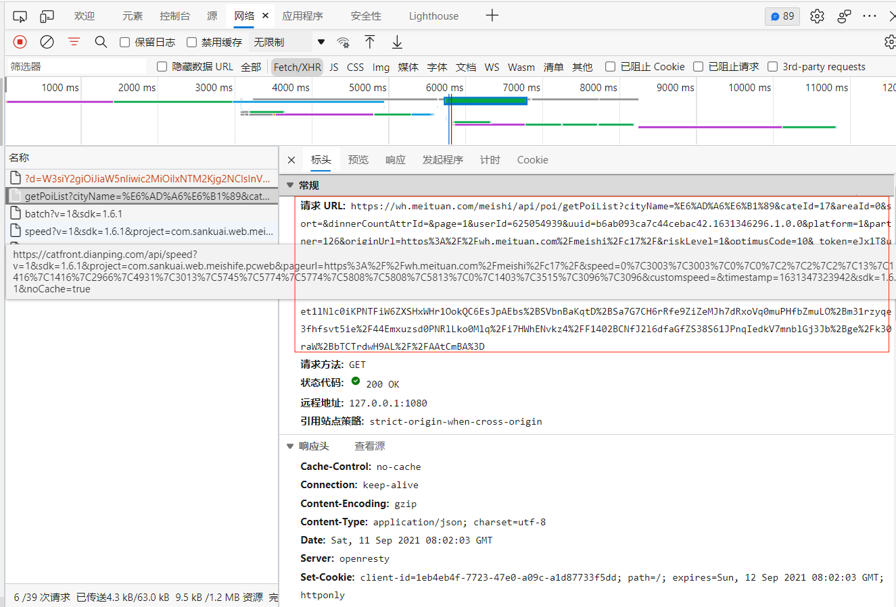
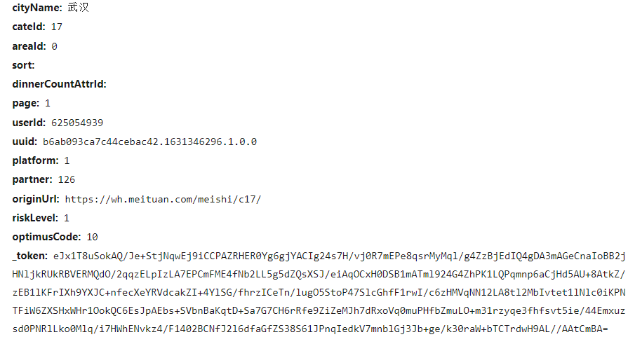

# 美团店铺评论抓取 -

## 介绍：

**涉及美团的店铺详情介绍抓取、店铺的评论抓取，以及后续的文本处理清洗，建模情感分析**

## 一、爬虫

### 整体思路

爬取武汉美团中的美食栏目下的火锅的二十家热门火锅店的详情页，每家火锅店铺的详细信息，爬取火锅店铺的详细信息后，继续抓取火锅店铺的所有评论，最后将评论信息提取出来存储到数据库中。

### 1. 构造网页爬取美团店铺的专属ID，获取商家的信息列表

链接格式为 https://wh.meituan.com/meishi/c17/，
具体页面如下图所示，
{:height="50%" width="50%"}

我们需要右击网页，检查源码（或者按 F12），在网络中找到 Ajax 请求，如下图所示


可以发现 链接格式为 "https://wh.meituan.com/meishi/api/poi/getPoiList?cityName=武汉&cateId=17&areaId=0&sort=&dinnerCountAttrId=&page=1&userId=625054939&uuid=b6ab093ca7c44cebac42.1631346296.1.0.0&platform=1&partner=126&originUrl=https://wh.meituan.com/meishi/c17/&riskLevel=1&optimusCode=10&\_token=eJx1T8uSokAQ/Je+StjNqwEj9iCCPAZRHER0Yg6gjYACIg24s7H/vj0R7mEPe8qsrMyMql/g4ZzBjEdIQ4gDA3mAGeCnaIoBB2jHNljkRUkRBVERMQdO/2qqzELpIzLA7EPCmFME4fNb2LL5g5dZQsXSJ/eiAqOCxH0DSB1mATml924G4ZhPK1LQPqmnp6aCjHd5AU+8AtkZ/zEB1lKFrIXh9YXJC+nfecXeYRVdcakZI+4YlSG/fhrzICeTn/lugO5StoP47SlcGhfF1rwI/c6zHMVqNN12LA8tl2MbIvtet1lNlc0iKPNTFiW6ZXSHxWHr1OokQC6EsJpAEbs+SVbnBaKqtD+Sa7G7CH6rRfe9ZiZeMJh7dRxoVq0muPHfbZmuLO+m31rzyqe3fhfsvt5ie/44Emxuzsd0PNRlLko0Mlq/i7HWhENvkz4/F1402BCNfJ2l6dfaGfZS38S61JPnqIedkV7mnblGj3Jb+ge/k30raW+bTCTrdwH9AL//AAtCmBA="，
十分繁琐的网页URL，因此我们需要拆分网页URL，可以发发现网页参数如下图所示：

我们利用python构造参数，拼接完整的网页URL，进行爬取，部分代码展示：
```python
def get_store(page, token):
    headers = {
        'user-agent': user_agent,
        'host': 'wh.meituan.com',
        'referer': 'https://wh.meituan.com/meishi/c17/pn' + str(page) + '/',
        'cookie': Cookie,
    }
    params = {
        'cityName': '武汉',
        'cateId': '17',
        'areaId': '0',
        'sort': '',
        'dinnerCountAttrId': '',
        'page': str(page),
        'userId': uu_user_id[1],
        'uuid': uu_user_id[0],
        'platform': '1',
        'partner': '126',
        'originUrl': headers['referer'],
        'riskLevel': '1',
        'optimusCode': '10',
        '_token': token
    }
    base_url = 'https://wh.meituan.com/meishi/api/poi/getPoiList?'
    try:
        response = requests.get(url=base_url, headers=headers, params=params)
        json = response.json()
        poiInfos = json.get('data').get('poiInfos')
        for info in poiInfos:
            del info['dealList']
            store_list.append(info)
    except Exception as e:
        print('爬取第 %s 页商铺信息出错'%page)
```

这样可以获得所有店铺的详细信息
### 2. 通过店铺ID，获取店铺的评论信息
第一步可以爬取到每个商家的专属ID，例如 六婆串串香 这家店，点击商家详情，可以发现网页跳转到 https://wh.meituan.com/meishi/5151532/ 其中 5151532 就属于这家店铺的专属ID，这一信息通过上一步爬取已经获得，利用专属ID可以拼接URL，得到每家商铺的网址，由此可以爬取每家店铺的评论信息。
部分代码展示如下：

```python
def store_comment(poiid, page, cookie):
    headers = {
        'user-agent': random.choice(user_agents),
        'host': 'wh.meituan.com',
        'referer': 'https://wh.meituan.com/meishi/%s/'%poiid,
        'cookie': cookie,
    }
    store_url = 'https://wh.meituan.com/meishi/api/poi/getMerchantComment?'
    params = {
        'uuid': 'f24c05a9c0d8464490b0.1630861808.1.0.0',
        'platform': '1',
        'partner': '126',
        'originUrl': 'https://wh.meituan.com/meishi/' + str(poiid) + '/',
        'riskLevel': '1',
        'optimusCode': '10',
        'id': str(poiid),
        'userId': '625054939',
        'offset': str(page*10),
        'pageSize': '10',
        'sortType': '1',
    }
    try:
        response = requests.get(url=store_url, headers=headers, params=params)
        json = response.json()
        comments = json.get('data').get('comments')
        for comment in comments:
            person = {}
            person['评论店铺'] = poiid
            person['评论用户姓名'] = comment['userName']
            person['评论用户id'] = comment['userId']
            person['评论用户星级'] = comment['star']
            person['评论用户菜品'] = comment['menu']
            person['评论用户内容'] = illegal_char.sub(r'', comment['comment'])
            person['评论用户内容'] = remove_emoji(person['评论用户内容'])
            person['评论时间'] = comment['commentTime']
            connect_mysql.save_data(person)
        time.sleep(random.randint(0,8))
    except Exception as e:
         return '出错'
```
